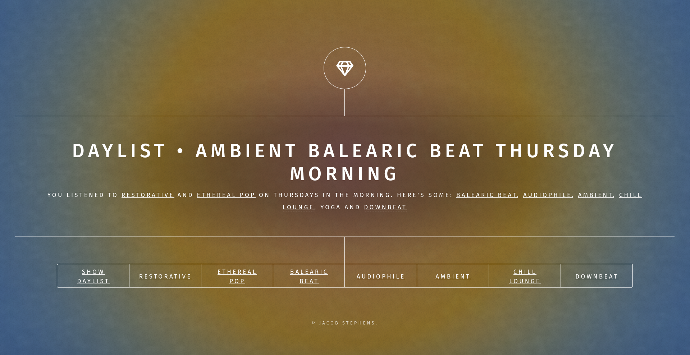
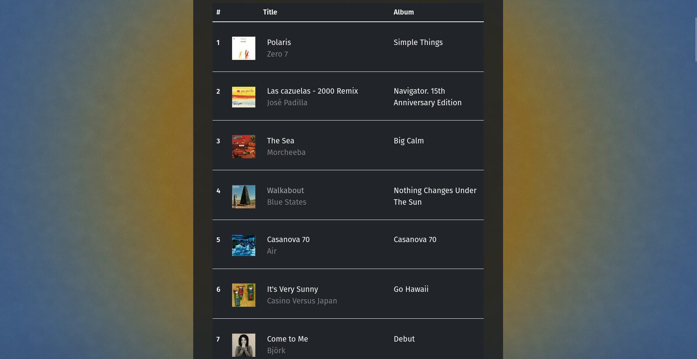

# Spotify Playlist Creator

## Link

http://jstep21.pythonanywhere.com/

The app is still in "development mode" and new users need to be added to an "allowlist," so please email me your name 
and email address associated with your Spotify account if you wish to try it out!

Email: jstephens1215@gmail.com  

## Introduction


The goal of this project is to be able to generate a new playlist from a Spotify user's personalized "daylist." Every 
Spotify user has access to their daylist, an auto-generated playlist based on a user's listening habits at a 
specific time of day. 

Let's say I check my daylist on a Thursday morning, all the songs in it will be based on 
music I typically listen to at that time of day. As you can see below, there are key descriptive words associated 
with my Thursday morning listening habits, such as "ethereal pop" or "balearic beat."



These key-words, along with the songs in the daylist, are updated every few hours or so throughout the day. For this 
website, the user is able to click any of the key-words (shown in the bottom list next to "Show Daylist") and see a 
different playlist Spotify generates for that key-word(s). This is in addition to being able to show the user's 
current daylist with the "Show Daylist" button along the bottom list.



From here, the user is able to click on any song and hear it play through their chosen audio device, given that they 
have it set up (more details below and in comments in <code>main.py</code>). 

Going back to the main page, when the user clicks the "generate playlist" button, they are presented with a dropdown 
menu to select from the different vibey key-words. The new playlist that gets generated will be based on the user's 
selections as well as the songs in the daylist. The name of the playlist will be created using what key-words the 
user selects too. Using the example above, the new playlist could be "thursday morning vibes: balearic beat, chill 
lounge, and downbeat."

## Prerequisites
<ul>
    <li><a href="https://www.jetbrains.com/pycharm/">Pycharm</a>, <a href="https://code.visualstudio.com/">VSCode</a>
(add the Python extension) or any other IDE for writing code in Python</li>
    <li>Have a Spotify account and log into <a href="https://developer.spotify.com/">Spotify for 
Developers</a> 
        <br> 
        <ul>
            <li>Go to your Dashboard and create a new app</li>
            <li>Add Client ID, Client Secret and Redirect URI to the project as environment variables</li>
            <li>Also add your Username and Device ID (optional but needed for audio playback, see comments in 
            <code>main.py</code> to find your audio device's id)
            </li>
        </ul>
    </li>
    <li>This project uses the <a href="https://flask.palletsprojects.com/en/3.0.x/">Flask</a> framework and the 
        <a href="https://spotipy.readthedocs.io/en/2.24.0/">Spotipy</a> Python library for the
        <a href="https://developer.spotify.com/documentation/web-api">Spotify Web API</a> (installation instructions below)
    </li>
</ul>

## Installation

### Clone this Repository

```bash
git clone https://github.com/jstep21/playlist-creator.git
```

### Install Necessary Packages

###### Flask

```bash
pip install flask
```

###### Spotipy

```bash
pip install spotipy
```
